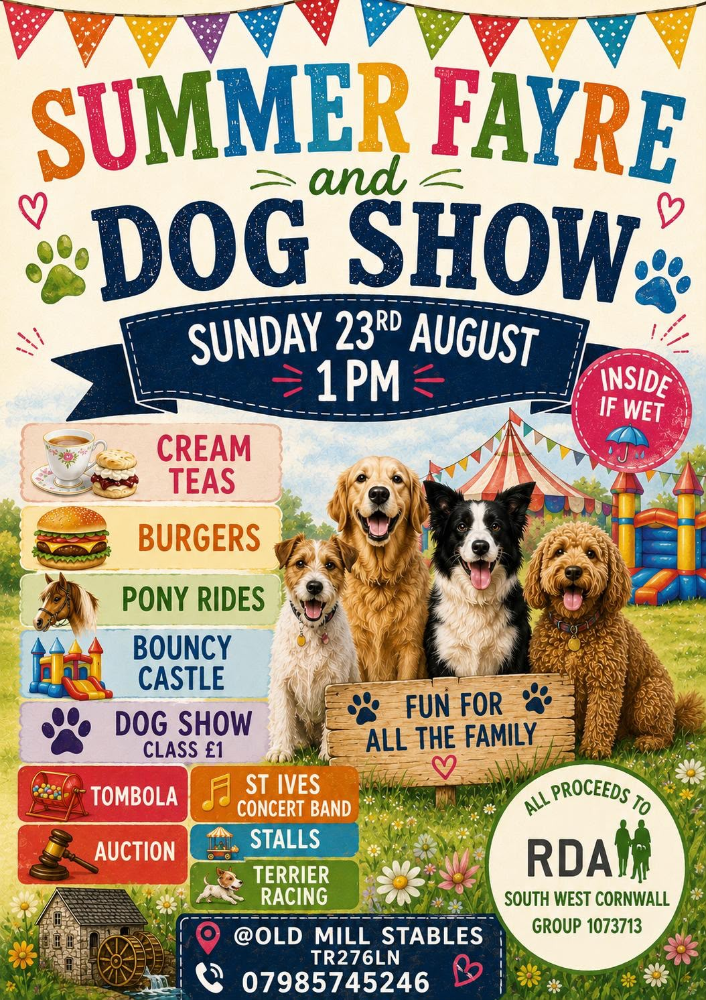

# AGENTS.md — the South West Cornwall Group RDA website

Read this before changing the site. It is read by Daneel's site agent (`site-rda` on the
AILANG message plane, which also follows `skills/daneel-site-SKILL.md` in
`sunholo-data/daneel`) and by anyone else editing here.

## What this is

A single-page static site for a charity, **served by GitHub Pages from `main`** at
<https://rdasouthwestgroup.org.uk>. There is no build step: `index.html`, `style.css`,
`thanks.html` and the files under `media/` are what visitors get. **Merging to `main`
publishes within about a minute.**

`main` is protected: a change arrives as a pull request with one approving review, and is
merged by a trustee or by Mark. Nobody pushes to `main` directly.

## Where things are in `index.html`

The page is one `<main>` of `<section>`s, each with an `id` the navigation links to:

| Section | `id` | What goes there |
|---|---|---|
| Events and news | `events` | upcoming events and announcements, newest-relevant first |
| About | `about` | |
| What we offer | `what-we-offer` | |
| Our horses | `horses` | |
| Our riders | `riders` | |
| Our volunteers | `volunteers` | |
| Tea with a Pony | `tea` | |
| Competitions | `competitions` | |
| Fundraising | `fundraising` | including the bank and card-payment details |
| Policies & downloads | `policies` | forms and policies as downloadable files |
| From our trustees | `trustees` | |

## Adding an event (the usual request)

Inside `<section id="events">`, each event is an **event banner** followed, when there is a
poster, by a **centred poster link**. Copy the existing pattern exactly; only the words,
the date, the colour and the file change:

```html
<div class="event-banner" aria-label="Upcoming Summer Fayre and Dog Show" style="background: linear-gradient(135deg, #E8A020 0%, #C07010 100%); margin-top: 1.5rem;">
  <div class="event-date" aria-label="23rd August 2026">
    <div class="day">23</div>
    <div class="month">Aug 2026</div>
  </div>
  <div>
    <h3>Summer Fayre &amp; Dog Show</h3>
    <p>Place &nbsp;·&nbsp; Day, date, time &nbsp;·&nbsp; what is on &nbsp;·&nbsp; Tel: …</p>
  </div>
</div>

<div style="margin-top: 1.5rem; display: flex; justify-content: center;">
  <a href="media/summer-fayre-dog-show-2026.jpeg" target="_blank" rel="noopener" aria-label="View full Summer Fayre and Dog Show poster">
    
  </a>
</div>
```

- **Order**: events in date order, soonest first. A news item with no date (like the card
  payments notice) uses an emoji in `day` and `News` in `month`.
- **Colour**: pick a gradient that is not already used by the event next to it. Seasonal is
  fine (deep red for Christmas, amber for summer, green for news).
- **Words**: take dates, times, places, prices and phone numbers **from the poster or the
  request, never invented**. Use the poster's own spelling and wording. `&amp;`, `&pound;`,
  `&nbsp;·&nbsp;` as the existing cards do.
- **Alt text**: the poster's full wording in one sentence. Screen-reader users get the
  poster only through it.
- **The poster file**: into `media/` with a short, lowercase-hyphenated name ending in the
  year, e.g. `harvest-supper-2026.jpeg`. Never a camera name like `image0.png` or
  `IMG_4021.jpeg`. Keep the file as it was given to you.

## Removing a past event

When adding an event, **also remove any event whose date has passed**, with its poster
block — say so in the pull request. Leave its image in `media/` (other pages or old links
may use it). If you are unsure whether an event has passed, leave it and say so.

## Forms and documents

Downloadable forms live under `media/` and are linked from `<section id="policies">`
(Policies & downloads). A replacement form keeps the old link working: update the link to
the new file rather than deleting the old one, unless the request says otherwise.

## Do not change, unless the request names it

- `CNAME`, `.github/`, `README.md`, `.gitignore`.
- The bank details, sort code and charity number (`fundraising`, footer).
- People's names, phone numbers and email addresses: do not add a person's contact details
  that are not already on the site or in the request.
- `style.css` — the cards above need no new CSS.
- No scripts, trackers, analytics, external embeds or forms that post elsewhere.

## Commits

One commit per request, prefixed `SWCG-RDA:` and saying what changed, e.g.
`SWCG-RDA: add Harvest Supper (12 Oct) with poster; remove past Summer Fayre`.
